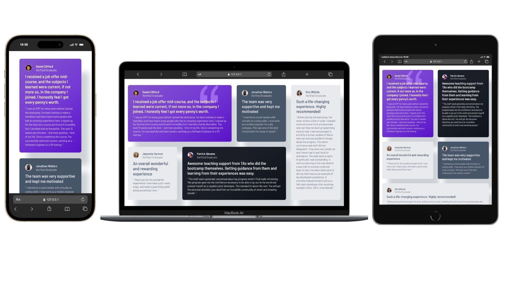

# ✨ Testimonials Grid Section

Projeto desenvolvido como parte de um desafio da Frontend Mentor, com foco na criação de uma seção de depoimentos em cartões, organizada em um layout moderno, responsivo e visualmente equilibrado.

## 📌 Visão Geral

A página apresenta cinco depoimentos de ex-alunos, cada um com avatar, nome, status de graduado verificado, título e relato. O layout usa diferentes cores e áreas de grade para destacar cada cartão e se adapta a dispositivos móveis, tablets e desktops.

## 📷 Preview



A página inclui depoimentos de:

- Daniel Clifford
- Jonathan Walters
- Jeanette Harmon
- Patrick Abrams
- Kira Whittle

## 🎯 Objetivos do Projeto

- Reproduzir o design proposto com atenção à hierarquia visual e aos detalhes;
- Criar um layout responsivo com CSS Grid e media queries;
- Praticar a organização de conteúdo semântico em HTML;
- Adicionar uma animação de entrada aos cartões com JavaScript.

## 🧩 Tecnologias & Ferramentas Utilizadas

- HTML5
- CSS3, incluindo CSS Grid, variáveis, media queries e CSS Nesting;
- JavaScript e Intersection Observer API;
- Google Fonts (Barlow Semi Condensed);
- Visual Studio Code
- Git & GitHub

## 🖼️ Estrutura do Projeto

```text
.
├── design/
│   ├── desktop-design.jpg
│   └── mobile-design.jpg
├── images/
├── index.html
├── design/
│   └── print.png
├── script.js
├── style-guide.md
└── style.css
```

## 🚀 Como Executar

1. Clone este repositório:

```bash
git clone https://github.com/lucasalbuquerque09/testimonials-grid-section-main.git
```

2. Acesse a pasta do projeto:

```bash
cd testimonials-grid-section-main
```

3. Abra o arquivo `index.html` no navegador. Se preferir, use uma extensão como Live Server no VS Code.

Não é necessário instalar dependências ou executar um processo de build.

## 📱 Responsividade

O layout reorganiza os cartões de acordo com o tamanho da tela: em uma coluna em dispositivos móveis, em duas colunas em tablets e em uma grade ampliada em telas maiores.

## ✨ Recursos Inclusos

- Cinco cartões de depoimentos com avatares e identificação dos autores;
- Layout em CSS Grid adaptado para diferentes larguras de tela;
- Paleta de cores e tipografia inspiradas no design do desafio;
- Animação suave de revelação dos cartões ao aparecerem na tela.

## 🏆 Desafio

Este projeto foi inspirado no desafio [Testimonials grid section](https://www.frontendmentor.io/challenges/testimonials-grid-section-Nnw6J7Un7), da plataforma Frontend Mentor.

## 👤 Autor

Desafio original da Frontend Mentor. 🎉

- Desafio: [Frontend Mentor](https://www.frontendmentor.io/);
- Solução: Lucas Albuquerque;
- Repositório: [GitHub](https://github.com/lucasalbuquerque09/testimonials-grid-section-main).

## 📜 Licença

Projeto criado para fins de estudo e prática.

---

**Bom código! 🎉** Lembre-se, todo especialista foi um dia iniciante. Continue construindo, continue aprendendo!
